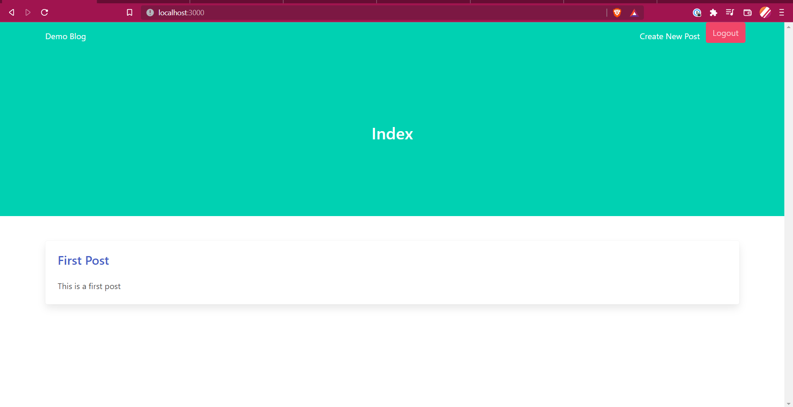
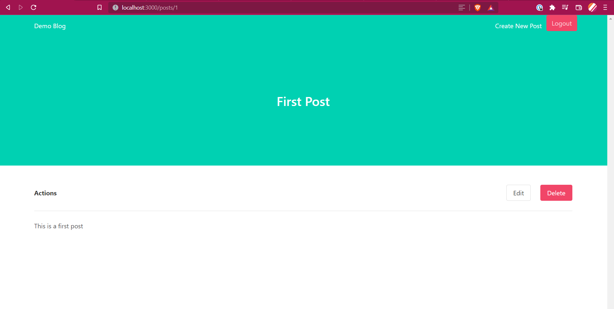
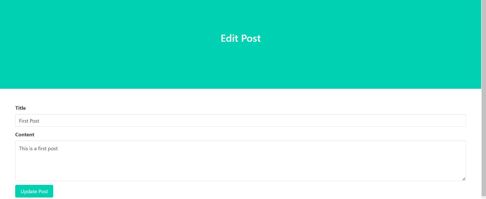

# Blog Application using Ruby on Rails

A simple blog application which uses following important gems:
- devise
- guard
- simple_form
- bulma-rails
- pg

We will be using Postgres as our primary database.

### Some Screenshots

